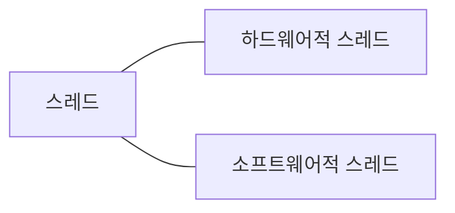
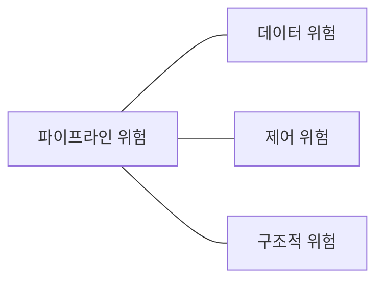

# Chapter5 CPU 성능 향상 기법

## 5-1) 빠른 CPU를 위한 설계 기법

### 클럭

CPU의 속도는 클럭의 속도에 의해 결정된다.

클럭 속도는 헤르츠 단위로 측정된다. 이는 1초에 클럭이 몇 번 반복되는지를 나타낸다. 클럭 속도는 일정하지 않다. 고성능을 요하는 순간에는 순간적으로 클럭 속도를 높이고, 그렇지 않을 때에는 유연하게 클럭 속도를 낮추기도 한다.

### 코어와 멀티코어

오늘날의 코어는 '명령어를 실행하는 부품을 포함하는 부품'으로 명칭한다. 코어를 여러 개 포함하고 있는 CPU를 **멀티코어 CPU** 또는 **멀티코어 프로세서**라고 부른다. 연산속도는 코어수에 비례하지 않는다. 코어마다 처리할 연산을 적절히 분배해야 한다.

### 스레드와 멀티스레드

**스레드**는 '실행 흐름의 단위'이다. 스레드는 CPU에서 사용되는 **하드웨어적 스레드**가 있고, 프로그램에 사용되는 **소프트웨어적 스레드**가 있다.

### 하드웨어적 스레드

스레드를 하드웨어적으로 정의하면 '하나의 코어가 동시에 처리하는 명령어 단위'를 의미한다. 하나의 코어안에 여러개의 하드웨어적 스레드를 가지고 있는 CPU를 **멀티스레드 CPU(프로세서)**라고 부른다. 인텔에선 **하이퍼스레딩**이라고 칭한다.

### 소프트웨어적 스레드

스레드를 소프트웨어적으로 정의하면 '하나의 프로그램에서 독립적으로 실행되는 단위'를 의미한다.

### 멀티스레드 프로세서

프로그램 입장에서 보았을 때, 한번에 하나의 명령어를 처리하는 CPU가 4개 있는 것처럼 보인다. 그래서 하드웨어 스레드를 **논리 프로세서**라고 부르기도 한다.

## 명령어 병렬 처리 기법

CPU를 한시도 쉬지 않고 작동시키는 기법인 **명령어 병럴 처리 기법**을 알아본다. 대표적인 명령어 병렬 처리 기법에는 **명령어 파이프 라이닝**, **슈퍼스칼라**, **비순차적 명령어 처리**가 있다.

### 명령어 파이프라인

명령어 처리 과정을 클럭 단위로 나누어 보면 다음과 같다.

1. 명령어 인출
2. 명령어 해석
3. 명령어 실행
4. 결과 저장

단계가 겹치지만 않는다면 CPU는 '각 단계를 동시에 실행할 수 있다.'

이처럼 공장 생산 라인과 같이 명령어들을 **명령어 파이프라인**에 넣고 동시에 처리하는 기법을 **명령어 파이프라이닝**이라고 한다.

파이프라이닝이 높은 성능을 가져오기는 하지만, 특정 상황에서는 성능 향상에 실패하는 경우도 있다. 이러한 상황을 **파이프라인 위험**이라고 부른다. 파이프라인 위험에는 크게 **데이터 위험**, **제어 위험**, **구조적 위험**이 있다.

### 데이터 위험

**데이터 위험**은 명령어 간 '데이터 의존성'에 의해 발생한다. 어떤 명령어는 이전 명령어의 결과를 사용해야한다. 이때, 이전 명령어의 결과가 아직 나오지 않았다면 데이터 위험이 발생한다.

ex) 명령어1: R1 <- R2 + R3, 명령어2: R4 <- R1 + R5

### 제어 위험

**제어 위험**은 주로 분기 등으로 인한 '프로그램 카운터의 갑작스러운 변화'에 의해 발생한다. 프로그램 실행 흐름이 바뀌어 명령어가 실행되면서 프로그램 카운터 값에 갑작스러운 변화가 생긴다면 명령어 파이프라인에 미리 가지고 와서 처리 중이었던 명령어들은 아무 쓸모가 없어지게 된다.

이런 위험을 막기 위해 **분기 예측**이라는 기술을 사용한다.

### 구조적 위험

**구조적 위험**은 명령어들을 겹쳐 실행하는 과정에서 서로 다른 명령어가 동시에 ALU, 레지스터 등과 같은 CPU 부품을 사용하려고 할 때 발생한다. 구조적 위험은 **자원 위험**이라고 부르기도 한다.

### 슈퍼 스칼라

파이프라이닝은 단일 파이프라인으로도 구현이 가능하지만, 오늘날 대부분의 CPU에서는 여러개의 파이프라인을 이용한다. 이를 **슈퍼스칼라**라고도 한다. 슈퍼스칼라 구조로 명령어 처리가 가능한 CPU를 **슈퍼스칼라  프로세서** 또는 **슈퍼스칼라 CPU**라고 부른다.

슈퍼스칼라 프로세서는 이론적으로 파이프라인 개수에 비례해서 프로그램 처리 속도가 빨라진다. 하지만 파이프라인 위험 등의 예상치 못한 문제가 있어 실제로는 파이프라인 개수에 비례하여 빨리지지는 않는다.

### 비순차적 명령어 처리(Out-of-Order Execution)

**비순차적 명령어 처리기법**은 명령어들을 순차적으로 실행하지 않는 기법이다.

서로 독립적은 명령어들은 순서에 상관 없이 실행할 수 있다.

## CISC와 RISC

CPU의 언어인 **ISA**와 각기 다른 성격의 ISA를 기반으로 설계된 CISC와 RISC를 알아본다.

### 명령어 집합

CPU가 이해할 수 있는 명령어 들의 모음을 **명령어 집합** 혹은 **명령어 집합 구조**이라고 한다.

인텔의 노트북 속 CPU는 x86 ISA를 이해하고, 애플의 아이폰 속 CPU는 ARM ISA를 이해한다.

### CISC

**CISC***는 Complex Instruction Set Computer의 약자이다. 해석하면 '복잡한 명령어 집합을 활용하는 컴퓨터'이다.

CISC는 다양하고 강력한 기능의 명령어 집합을 활용하기 때문에 명령어의 형태와 크기가 다양한 **가변 길이 명령어**를 활용한다.

CISC에는 치명적인 단점이 있다. 활용하는 명령어가 워낙 복잡하고 다양한 기능을 제공하는 탓에 명령어의 크기와 실행되기까지의 시간이 일정하지 않다. 그리고 복잡한 명령어 때문에 명령어 하나를 실행하는데에 여러 클럭 주기를 필요로 한다. (명령어 규격화가 어려워 파이프라이닝이 어렵다)

CISC의 한계

1. 빠른 처리를 위해 명령어 파이프라인을 십분 활용해야 한다. 원할한 파이프라이닝을 위해 '명령어 길이와 수행 시간이 짧고 규격화'되어 있어야 한다.
2. 어차피 자주 쓰이는 명령어만 줄곧 사용된다.

### RISC

RISC는 Reduced Instruction Set Computer의 약자이다. 이름처럼 RISC는 CISC에 비해 명령어의 종류가 적다. RISC는 **고정 길이 명령어**를 활용한다.

