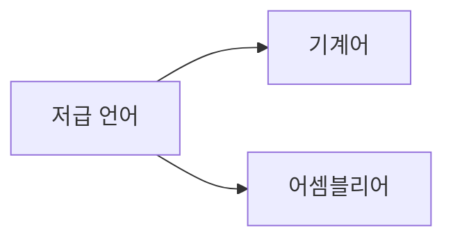
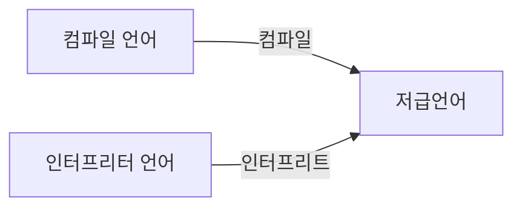

# Chapter3 명령어

## 3-1) 소스코드와 명령어

### 고급언어와 저급언어

**고급언어** : 사람을 위한 언어

**저급언어** : 컴퓨터가 직접 잏하고 실행할 수 있는 언어

고급언어로 작성된 소스코드가 실행되려면 반드시 저급언어인 명령어로 변환되어야 한다.

저급언어에는 두 가지 종류가 있다.

**기계어** : 0과 1의 명령어 비트로 이루어진 언어

**어셈블리어** : 기계어에 대응하는 기호로 이루어진 언어

### 컴파일 언어와 인터프리터 언어

- 고급언어로 작성한 소스코드는 결국 저급언어로 변환된다.
- **컴파일**방식과 **인터프리트**방식이 있다.

### 컴파일 언어

- 컴파일러에 의해 소스 코드 전체가 저급 언어로 변환되어 실행되는 고급언어 EX) C
- 소스코드 한 줄이라도 오류가 있으면 전체가 실행되지 않는다.

**컴파일** : 컴파일 언어로 작성된 소스코드 전체를 저급언어로 변환 되는 과정

**컴파일러** : 컴파일을 수행해주는 도구

**목적코드** : 컴파일러를 통해 저급언어로 변환된 코드

### 인터프리터 언어

- 인터프리터에 의해 소스 코드가 한 줄씩 실행되는 고급 언어 EX) Python
- 소스코드 한 줄이라도 오류가 있어도 그 이전 코드는 실행된다.

**인터프리트** : 인터프리터 언어로 작성된 소스코드를 한 줄씩 저급언어로 변환되는 과정

**인터프리터** : 인터프리트를 수행해주는 도구

실행속도는 컴파일언어가 빠르지만, 개발속도는 인터프리터 언어가 빠르다.

### 목적파일 vs 실행파일

**목적파일** : 목적코드로 이루어진 파일

**실행파일** : 링킹작업을 통해 목적파일을 실행파일로 만든 파일

**링킹** : 여러 목적파일을 하나의 실행파일로 만드는 과정

## 3-2) 명령어의 구조

### 연산 코드와 오퍼랜드

명령어는 연산 코드와 오퍼랜드로 구성된다.

**연산 코드** : 명령어가 수행할 연산 (연산자)

**오퍼랜드** : 연산에 사용할 데이터 혹은 연산에 사용할 데이터가 저장된 위치 (피연산자)

### 오퍼랜드

오퍼랜드 필드엔 연산에 사용할 데이터를 담기도 하지만 사용할 데이터가 저장된 위치, 즉 메모리 주소나 레지스터 이름이 담기기도 한다.

오퍼랜드 필드를 **주소필드**라고도 한다.

오퍼랜드 수에 따라 명령어를 다르게 부른다.

- 0-주소명령어 : 오퍼랜드가 없는 경우
- 1-주소명령어 : 오퍼랜드가 1개인 경우
- 2-주소명령어 : 오퍼랜드가 2개인 경우
- 3-주소명령어 : 오퍼랜드가 3개인 경우

### 연산 코드

연산 코드 유형은 크게 4가지로 나눌 수 있다.

1. 데이터 전송
2. 산술/논리 연산
3. 제어 흐름 변경
4. 입출력 제어

### 주소 지정 방식

오퍼랜드 필드에 연산에 사용될 데이터 대신 주소를 담으면 더 큰 값을 다룰 수 있다.

명령어에 길이 때문에, 오퍼랜드 필드에 담는 값이 작아서 다룰 수 있는 값의 범위가 제한된다.

그래서 오퍼랜드 필드에 데이터가 저장된 위치를 담게 되었는데, 데이터가 저장된 위치를 **유효주소**라고 한다.

데이터가 저장된 위치를 명시할 때, 연산에 사용할 데이터 위치를 찾는 방법을 **주소지정방식**이라고 한다.

### 즉시 주소 지정방식

- 연산에 사용할 데이터를 오퍼랜드 필드에 직접 명시하는 방식.

표현하는 값의 범위가 제한되지만, 연산에 사용할 데이터를 메모리나 레지스터로부터 찾는 과정이 없어, 다른 주소 지정 방식들보다 빠르다.

### 직접 주소 지정방식

- 오퍼랜드 필드에 유효주소를 직접적으로 명시하는 방식.

표현하는 값의 크기는 커졌지만, 데이터를 찾는 과정이 없어 즉시 주소 지정방식보다 느리다.

### 간접 주소 지정방식

- 오퍼랜드 필드에 유효주소가 아닌, 데이터가 저장된 위치를 찾는 주소를 명시하는 방식. (유효주소의 주소)

표현하는 값의 크기는 커졌지만, 데이터를 찾는 과정이 2번 있어 직접 주소 지정방식보다 느리다.

### 레지스터 주소 지정방식

- 레지스터 주소 지정방식은 오퍼랜드 필드에 레지스터 이름을 명시하는 방식이다.

CPU 외부에 있는 메모리에 접근하는 것보다, CPU 내부에 있는 레지스터에 접근하는 것이 빠르다. 그러므로 직접 주소방식보다 빠르다.

### 레지스터 간접 주소 지정방식

- 연산에 사용할 데이터를 메모리에 저정하고, 그 주소를 저장한 레지스터를 오퍼랜드 필드에 명시하는 방법

간접 주소방식과 비슷하지만, 메모리에 접근하는 횟수가 한번으로 줄어든다.
그러므로 간접 주소방식보다 빠르다.

