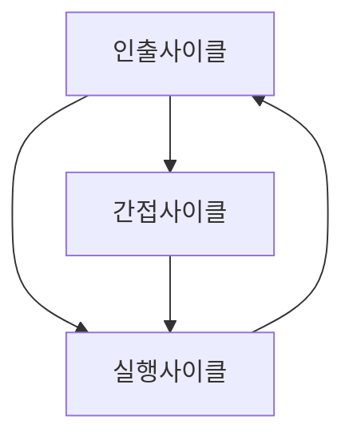
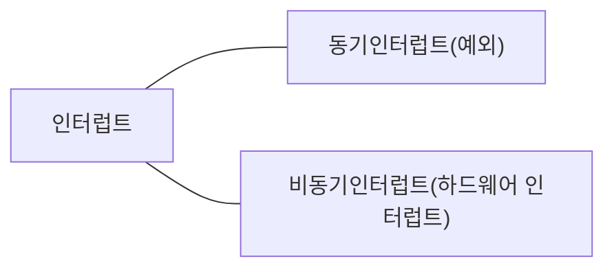
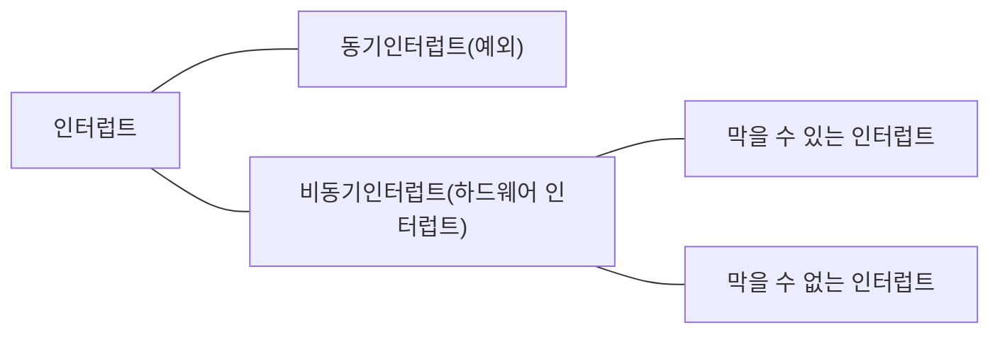

# Chapter4 CPU의 작동원리

## 4-1) ALU와 제어장치

### ALU

ALU는 **레지스터**를 통해 **피연산자**를 받아들이고 **제어장치**로부터 **제어신호**를 받아들인다.

연산을 수행한 결과는 숫자나 문자가 될 수도 있고, 메모리 주소가 될 수도 있다. 이 결괏값은 바로 메모리에 저장되지 않고 일시적으로 **레지스터**에 저장된다.

왜 why? -> **레지스터**는 **CPU** 내부에 있기 때문에, **메모리**보다 빠르게 접근할 수 있기 때문에.

추가로 계산결과와 더불어 **플래그**를 내보낸다.
ex) 부호플래그, 제로플래그, 오버플로우플래그,인터럽트플래그, 슈퍼바이저플래그 등

플래그들은 **플래그 레지스터**에 저장된다.

### 제어장치

제어장치가 받아들이는 정보들은 다음과 같다.

1. 제어장치는 클럭신호를 받아들인다.

**클럭**이란 컴퓨터 부품들을 움직일 수 있게 하는 시간 단위이다.

2. 제어장치는 '해석해야 할 명령어'를 받아들인다.

**명령어 레지스터**로 부터 해석할 명령어를 받아들이고 해석한 뒤, 제어신호를 발생시켜 컴퓨터 부품들에 수행해야 할 내용을 알려준다.

3. 제어장치는 플래그 레지스터 속 플래그 값을 받아들인다.

**플래그 레지스터**로 부터 ALU연산에 대한 추가적인 정보상태를 받아들인다.

4. 제어장치는 시스템 버스, 그중에서 제어버스로 전달된 제어 신호를 받아들인다.

제어 신호는 CPU뿐만 아니라 입출력장치를 비롯한 CPU외부 장치도 발생시킬 수 있다.

제어장치는 제어버스를 통해 CPU외부로도 제어신호를 전달할 수 있다. 이러한 제어신호에는 크게 메모리에 전달하는 제어신호와 입출력장치에 전달하는 제어신호가 있다.

## 4-2) 레지스터

### 반드시 알아야 할 레지스터

1. **프로그램 카운터(PC)**

메모리에서 가져올 명령어의 주소, 즉 메모리에서 읽어 들일 명령어의 주소를 저장하는 레지스터다.

프로그램 카운터를 **명령어 포인터**라고도 한다.

2. **명령어 레지스터(IR)**

해석할 명령어, 즉 방금 메모리에서 읽어 들인 명령어를 저장하는 레지스터다.

3. **메모리 주소 레지스터**

메모리의 주소를 저장하는 레지스터다.

CPU가 읽어 들이고자 하는 주소 값을 주소 버스로 보낼 때 메모리 주소 레지스터를 거치게 된다.

4. **메모리 버퍼 레지스터(MDR)**

메모리와 주고받을 값을 저장하는 레지스터다.

즉, 메모리에 쓰고 싶은 값이나 메모리로부터 전달받은 값은 메모리 버퍼 레지스터를 거친다.

메모리에 저장된 프로그램 실행과정

CPU로 실행할 프로그램이 1000번지부터 1500번지까지 저장되어있다고 가정하자.

1. 프로그램을 처음부터 실행하기 위해 프로그램 카운터에 1000이 저장된다.
2. 1000번지를 읽어 들이기 위해서는 주소버스로 1000번지를 내보내야한다. 이를 위해 메모리 주소 레지스터에 1000이 저장된다.
3. '메모리 읽기' 제어 신호와 메모리 주소 레지스터 값이 각각 제어 버스와 주소 버스를 통해 메모리로 보내진다.
4. 메모리 1000번지에 저장된 값은 데이터 버스를 통해 메모리 버퍼 레지스터로 전달되고, 프로그램 카운터는 증가되어 다음 명령어를 읽어 들일 준비를 한다.
5. 메모리 버퍼 레지스터에 저장된 값은 명령어 레지스터로 이동한다.
6. 제어장치는 명령어 레지스터의 명령어를 해석하고 제어 신호를 발생시킨다.

5. **범용 레지스터**

다양하고 일반적인 상황에서 자유롭게 사용하는 레지스터다.

데이터와 주소를 모두 저장할 수 있다.

6. **플래그 레지스터**

연산 결과 또는 CPU상태에 대한 부가적인 정보를 저장하는 레지스터다.

7. **스택포인터(SP)**

**스택 주소 지정방식**이라는 주소 지정 방식에 사용된다.

스택주소 지정방식은 스택과 스택포인터를 이용한 주소 지정방식이다.

스택포인터란 스택의 꼭대기를 가리키는 레지스터다.

8. **베이스 레지스터(BR)**

**베이스 레지스터 주소 지정방식**에 사용되는 레지스터다.

변위 주소 지정방식에는 **베이스 레지스터 주소 지정 방식**과 **상대 주소 지정 방식**이 있다. 레지스터 값에 오퍼랜드를 더하여 유효주소를 얻는다.

연산 코드 | 레지스터 | 오퍼랜드

**상대 주소 지정 방식**은 오퍼랜드와 프로그램 카운터의 값을 더하여 유효 주소를 얻는 방식이다.

ex) 연산코드 | 프로그램 카운터 | -3

CPU는 읽어 들이기로 한 명령어로부터 '세번째 이전' 번지로 접근한다.

**베이스 레지스터 주소 지정 방식**은 오퍼랜드와 베이스 레지스터의 값을 더하여 유효 주소를 얻는 방식이다. 여기서 베이스 레지스터는 '기준 주소'가 된다.

ex) 연산코드 | 베이스 레지스터(200) | 50

기준 주소(200)으로 부터 50번지 떨어진 250번지로 접근한다.

## 4-3) 명령어 사이클과 인터럽트

### 명령어 사이클

프로그램 속 각각의 명령어들은 일정한 주기가 반복되며 실행되는데, 이 주기를 **명령어 사이클**이라고 한다.

명령어 사이클은 **인출 사이클**과 **실행 사이클**을 반복하며 실행한다.

**인출 사이클** : 메모리에 있는 명령어를 CPU로 가져오는 단계

**실행 사이클** : CPU로 가져온 명령어를 실행하는 단계

모든 명령어가 이렇게 실행되는건 아니다.

만약 간접 주소지정방식을 사용할 시, 오퍼랜드 필드엔 유효주소의 주소를 명시한다. 이 경우 명령어를 인출하기 위하여 메모리에 한번 더 접근해야한다.

### 인터럽트

CPU의 작업을 방해하는 신호를 **인터럽트**라고 한다.

인터럽트의 종류에는 크게 동기 인터럽트와 비동기 인터럽트가 있다.

**동기 인터럽트**는 CPU에 의해 발생하는 인터럽트이다.

CPU가 명령어들을 수행하다가 예상치 못한 상황에 마주쳤을 때(프로그래밍상 오류같은)발생하는 인터럽트이다. 동기 인터럽트는 **예외**라고 부른다.

**비동기 인터럽트**는 주로 입출력장치에 의해 발생하는 인터럽트이다.
ex) 키보드로 입력을 받을 때, 마우스로 클릭을 할 때

**하드웨어 인터럽트**는 알림과 같은 인터럽트이다. 명령어를 효율적으로 처리하기 위해 사용된다.

ex) CPU가 프린터에 출력을 명령했다고 가정. 입출력장치는 CPU보다 속도가 느리다. 이때 만약 하드웨어 인터럽트를 사용하지 않는다면 CPU는 프린터가 언제 프린트를 끝낼지 모르기 때문에 주기적으로 프린터의 완료 여부를 확인해야한다. 하드웨어 인터럽트를 이용해 CPU는 프린터로부터 프린트 완료 인터럽트를 받을 때까지 다른 작업을 처리할 수 있다.

### 하드웨어 인터럽트 처리과정

1. 입출력 장치는 CPU에 **인터럽트 요청 신호**를 보낸다.
2. CPU는 실행사이클이 끝나고 명령어를 인출하기 전 항상 인터럽트 여부를 확인한다.
3. CPU는 인터럽트 요청을 확인하고 **인터럽트 플래그**를 통해 현재 인터럽트를 받아들일 수 있는지 여부를 확인한다.
4. 인터럽트를 받아들일 수 있다면, CPU는 지금까지의 작업을 백업한다.
5. CPU는 **인터럽트 벡터**를 참조하여 **인터럽트 서비스 루틴(ISR)**을 실행한다.
6. 인터럽트 서비스 루틴 실행이 끝나면 4에서 백업해 둔 작업을 복구하여 실행을 재개한다.

CPU가 인터럽트 요청을 수용하기 위해서는 플래그 레지스터의 **인터럽트 플래그**가 활성화 되어있어야 한다. 인터럽트 플래그는 말 그대로 하드웨어 인터럽트 받아들일지, 무시할지를 결정하는 플래그다. CPU가 중요한 작업을 처리해야 하거나 어떤 방해도 받지 않아야 할 때 인터럽트 플래그는 불가능으로 설정된다.

플래그 레지스터

부호 플래그 | 제로 플래그 | 캐리 플래그 | 오버플로우 플래그 | 인터럽트 플래그 | 슈퍼바이저 플래그

다만 모든 하드웨어 인터럽트를 막을 수 있는건 아니다. 정전이나 하드웨어 고장으로 인한 인터럽트는 반드시 가장먼저 처리해야하는 인터럽트이다.

CPU가 인터럽트 요청을 받아들이기로 했다면 CPU는 인터럽트 서비스 루틴(ISR)이라는 프로그램을 실행한다. **인터럽트 서비스 루틴(ISR)**은 인터럽트를 처리하기 위한 프로그램이다. **인터럽트 핸들러**라고도 한다.
**인터럽트 벡터**를 통해 각기다른 인터럽트 서비스 루틴을 식별하기 위한 정보이다.
CPU는 인터럽트 서비스 루틴을 실행하기 전에 프로그램 카운터 값 등 현재 프로그램을 재개하기 위해 필요한 모든 내용을 스택에 백업한다.