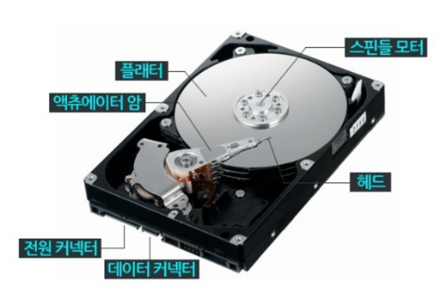
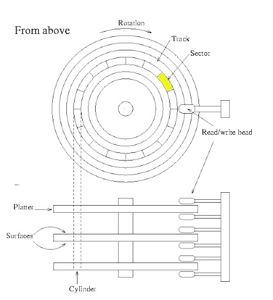

# Chapter7 보조기억장치

## 7-1) 다양한 보조기억장치

### 하드 디스크

하드디스크는 자기적인 방식으로 데이터를 저장한다. 이 때문에 하드디스크를 **자기 디스크**의 일종으로 지칭한다.

하드디스크에서 실질적으로 데이터가 저장되는 곳은 **플래터**라는 원판이다. 플래터는 자기물질로 덮여 있어 수많은 N극과 S극을 저장한다. N극과 S극은 각각 0과 1의 역할을 수행한다. 플래터는 여러겹으로 이루어져있으며, 각 플래터의 양면에 데이터를 저장할 수 있다.

플래터를 회전시키는 구성요소들 **스핀들**이라고 한다. 스핀들이 플래터를 돌리는 속도는 분당 회전수를 나타내는 **RPM**이라는 단위로 표현된다.

플래터를 대상으로 데이터를 읽고 쓰는 구성 요소는 **헤드**라고 한다. 헤드는 원하는 위치로 헤드를 이동시키는 **디스크 암**에 부착되어 있다.

플래터는 **트랙**과 **섹터**라는 단위로 데이터를 저장한다. 플래터를 여러 동심원으로 나누었을 때, 그중 하나의 원을 트랙이라고 부른다. 트랙은 피저처럼 여러 조각으로 나뉘는데, 이 조각을 섹터라고 부른다.

여러겹의 플래터 상에서 같은 트랙이 위치한 곳을 모아 연결한 논리적 단위를 **실린더**라고 부른다.

한 플래터를 동심원으로 나눈 공간은 트랙, 같은 트랙끼리 연결한 원통 모양의 공간은 실린더이다.

하드디스크가 저장된 데이터에 접근하는 시간은 크게 **탐색시간**, **회전지연**, **전송시간**으로 나뉜다.

- **탐색시간**: 접근하려는 데이터가 저장된 트랙까지 헤드를 이동시키는 시간을 의미한다.

- **회전지연**: 헤드가 있는곳으로 플래터를 회전시키는 시간을 의미한다.

- **전송시간**: 하드디스크와 컴퓨터간에 데이터를 전송하는 시간을 의미한다.

### 플래시 메모리

최근에는 **플래시 메모리**또한 보조기억장치로 많이 사용한다. 플래시 메모리는 전기적으로 데이터를 읽고 쓸 수 있는 반도체 기반의 저장 장치이다.

플래시 메모리는 크게 두종류가 있다. **NAND형**과 **NOR형**이다. 대용량 저장장치로 자주사용되는 플래시 메모리는 NAND형이다.

플래시 메모리에는 **셀**이라는 단위가 있다. 셀은 플래시 메모리에서 데이터를 저장하는 가장 작은 단위이다. 하나에 셀에 몇 비트를 저장할 수 있느냐에 따라 플래시 메모리 종류가 나뉜다. 한 셀에 1비트를 저장할 수 있는 플래시 메모리를 **SLC(Single Level Cell)**타입, 한 셀에 2비트를 저장할 수 있는 플래시 메모리를 **MLC(Multiple Level Cell)**타입, 한 셀에 3비트를 저장할 수 있는 플래시 메모리를 **TLC(Triple Level Cell)**타입이라고 한다.

**SLC 타입**

한 셀로 두개의 정보를 표현할 수 있다. SLC타입은 비트의 빠른 입출력이 가능하다. 수명 또한 길다. 하지만 용량 대비 가격이 높다. 주로 데이터를 읽고 쓰기가 많이 반복되며 고성능의 빠른 저장장치가 필요한 경우에 사용된다.

0,1

**MLC 타입**

한 셀로 네개의 정보를 표현할 수 있다. SLC타입에 비해 속도와 수명은 떨어지지만, 대용화 하기 유리하다.

00,01,10,11

**TLC 타입**

한 셀로 여덟개의 정보를 표현할 수 있다. SLC, MLC에 비해 속도와 수명이 더 떨어지지만, 대용량 저장장치로 사용된다.

### 플래시 메모리 단위

셀들이 모여 **페이지**, 페이지가 모여 **블록**이 된다. 블록이 모여 **플레인**, 플레인이 모여 **다이**가 된다.

셀 -> 페이지 -> 블록 -> 플레인 -> 다이

플래시 메모리에서 읽기와 쓰기는 페이지 단위로 이루어 진다. 하지만 삭제는 페이지보다 큰 블록단위로 이루어진다. 읽기/쓰기 단위와 삭제 단위가 다르다는 것이 가장 큰 특징이다.

이때 페이지는 3개의 상태를 가질 수 있다. **Free**, **Valid**, **Invalid**이다. **Free상태**는 어떠한 데이터도 저장하고 있지 않아 새로운 데이터를 저장할 수 있는 상태를 의미하고, **Valid상태**는 이미 유효한 데이터를 저장하고 있는 상태를 의미한다. 그리고 **Invalid상태**는 쓰레기 값이라 부르는 유효하지 않은 데이터를 저장하고 있는 상태를 의미한다. 플래시 메모리는 덮어쓰기가 불가능하여 Valid상태의 페이지에는 새 데이터를 저장할 수 없다.

ex) 블록 x에 4개의 페이지가 있다고 가정하자.

A,B,C 페이지를 저장하고 있을 때, A데이터를 A'으로 수정하고싶다면?

A,B,C,A'으로 데이터를 쓰여, A는 Invalid상태가 된다. 그렇다고 A만 삭제할 순 없다. 삭제는 블록단위로 작동하므로. 낭비되는 A공간을 **가비지 컬렉션**공간을 통해 재활용한다.

유효한 페이지만을 새로운 블록으로 복사한뒤 기존의 블록을 삭제한다.

A,B,C,A' -> B,C,A'

## 7-2) RAID의 정의와 종류

### RAID의 정의

**RAID (Redundant Array of Independent Disks)** 는 주로 하드 디스크와 SSD를 사용하는 기술로, 데이터의 안정성 혹은 높은 성능을 위해 여러개의 물리적 보조기억장치를 하나의 논리적 보조기억장치처럼 사용하는 기술을 의미한다.

ex) 1TB 장치 5개가 아니라 5TB 장치 1개로 인식

### RAID의 종류

RAID의 구성 방법을 **RAID 레벨**이라 표현하는데, RAID 레벨에는 대표적으로 RAID 0, RAID 1, RAID 2, RAID 3, RAID 4, RAID 5, RAID 6, RAID 10, RAID 50이 있다.

### RAID 0

**RAID 0**은 여러개의 보조기억장치에 데이터를 단순히 나누어 저장하는 구성 방식이다.

ex) 4개의 하드디스크로 RAID 0을 구성했을 때

저장하려는 데이터 A1, A2, A3, A4, B1, B2, B3, B4가 있다고 가정하자. A1, A2, A3, A4를 각각 다른 하드디스크에 저장하고, B1, B2, B3, B4를 각각 다른 하드디스크에 저장한다.

    			A1	A2  A3	A4
    			B1	B2  B3	B4
    하드디스크 	 1 	 2 	 3 	 4

이때 줄무니처럼 분산되어 저장된 데이터를 **스트라입**이라 하고, 분산하여 저장하는 것을 **스트라이핑**이라고 한다.

하나의 대용량 저장장치였다면, 여러번에 걸쳐 데이터를 읽고 써야하지만, 스트라이핑되면 동시에 읽고 쓸수 있다.

다만 단점으로 저장된 정보가 안전하지 않단 점이 있다. 하나의 하드디스크가 고장나면 모든 데이터가 손실된다.

### RAID 1

**RAID 1**은 복사본을 만드는 방식이다.

마치 거울처럼 완전한 복사본을 만드는 구성이기에 **미러링**이라고 한다. RAID 0처럼 데이터 스트라이핑이 사용되긴 했지만, 오른쪽의 두 하드 디스크는 마치 거울 처럼 동일한 내용을 저장하고 있다. 하지만, 데이터를 쓸 때 원본과 복사본 두 군데에 쓰기에, 쓰기 속도는 RAID 0보다 느리다.

    			A1	A2  A1	A2
    			B1	B2  B1	B2
    하드디스크 	 1 	 2 	 3 	 4

RAID 1 방식은 복구가 매우 간단하다는 장점이 있다. 하지만 RAID 1은 하드디스크 개수가 한정되었을 때, 사용가능한 용량이 적어지는 단점이 있다.

### RAID 4

**RAID 4**는 RAID 1처럼 완전한 복사본을 만드는 대신 오류를 검출하고 복구하기 위한 정보를 저장한 장치를 두는 구성 방식이다. 이때 '오류를 검출하고 복구하기 위한 정보'를 **패리티 비트**라고 한다. RAID 4에서는 패리티를 저장한 장치를 이용해 다른 장치들의 오류를 검출하고, 오류가 있다면 복구한다.

    			A1	A2  A3 패리티A
    			B1	B2  B3 패리티B
    하드디스크 	 1 	 2 	 3 	 4

### RAID 5

RAID 4에서는 새로운 데이터가 저장될 때마다 패리티를 저장하는 디스크에도 데이터를 쓰게되므로 패리티를 저장하는 장치에 병목현상이 발생한다는 문제가 있다. **RAID 5**는 패리티 정보를 분산하여 저장하는 방식이다.

    			A1	A2  A3 패리티A
    			B1	B2  패리티B A4
    하드디스크 	 1 	 2 	 3 	 4

### RAID 6

**RAID 6**의 구성은 기본적으로 RAID 5와 같으나, 서로 다른 두개의 패리티를 두는 방식이다. 이렇게하면 오류를 검출하고 복구할 수 있는 수단이 두개가 생긴다. 다만 새로운 정보를 저장할 때마다 함께 저장할 패리티가 두개이므로 쓰기속도는 RAID 5보다 느리다.

    			A1	A2  A3 패리티A
    			B1	B2  패리티B A3
				C1	C2  패리티C C3
    하드디스크 	 1 	 2 	 3 	 4

