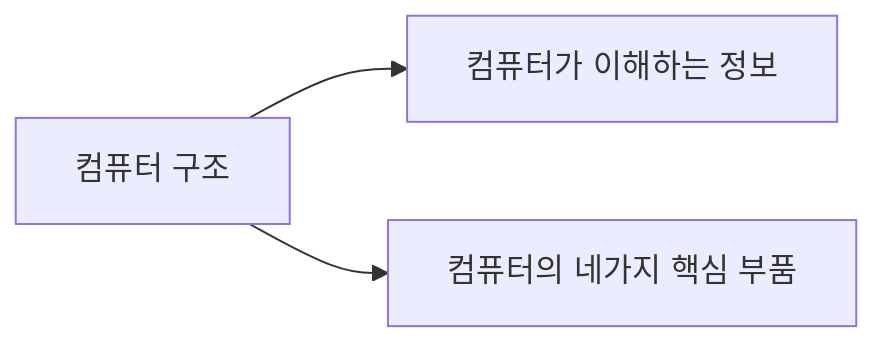

# Chapter 1. 컴퓨터 구조 시작하기

## 컴퓨터 구조를 알아야 하는 이유
- 컴퓨터 구조를 이해하면 문제 해결 능력이 향상된다.
- 컴퓨터 구조를 이해하면 문법만으로는 알기 어려운 성능/용량/비용을 고려하며 개발할 수 있다.

## 컴퓨터 구조의 큰 그림

## 컴퓨터의 4가지 핵심 부품
### 중앙처리장치 (CPU)
메모리에 저장된 명령어를 읽어 들이고, 읽어 들인 명령어를 해석하고, 실행하는 부품
- ALU

    계산을 위해 존재하는 부품
- 레지스터

    프로그램을 실행하는 데 필요한 값들을 임시로 저장 \
    CPU 내부에는 여러 개의 레지스터가 존재하고 각기 다른 이름과 역할을 가지고 있다.
- 제어장치

    제어 신호라는 전기 신호를 내보내고 명령어를 해석하는 장치.\
    제어신호랑 컴퓨터 부품들을 관리하고 작동시키기 위한 일종의 전기신호. 

### 주기억장치 (메모리)
메모리는 현재 실행되는 프로그램의 명령어와 데이터를 저장하는 부품으로 프로그램이 실행되려면 반드시 메모리에 저장되어 있어야한다.   
- ROM

### 보조기억장치
주기억 장치의 휘발성,용량 때문에 생긴 장치로, 메모리보다 크기가 크고 전원이 꺼져도 저장된 내용을 잃지 않는 메모리를 보조할 저장 장치가 필요하게 되었는데, 이것이 보조기억장치

### 입출력장치

마이크, 스피커, 프린터, 마우스, 키보드처럼 컴퓨터 외부에 연결되어 컴퓨터 내부와 정보를 교환하는 장치를 의미

### 메인보드와 시스템버스

메인보드에 연결된 부품들은 서로 정보를 주고받을 수 있는데, 이는 메인보드 내부에 버스라는 통로가 있기 때문입니다.
컴퓨터 내부에는 다양한 종류의 통로, 즉 버스가 있습니다. 하지만 여러 버스 가운데 컴퓨터의 네 가지 핵심 부품을 연결하는 가장 중요한 버스는 시스템 버스입니다.

시스템 버스는 **주소버스**, **데이터버스**, **제어 버스**로 구성되어 있습니다. \
주소버스는 주소를 주고 받는 통로, 데이터 버스는 명령어와 데이터를 주고받는 통로, 제어버스는 제어 신호를 주고받는 통로

**CPU 작동 흐름**

CPU가 메모리를 읽을 때
1. 제어버스로 '메모리 읽기' 제어신호를 보내기
2. 주소 버스로 읽고자 하는 주소를 내보냄
3. 메모리는 데이터 버스로 CPU가 요청한 주소에 있는 내용을 전송

CPU가 메모리에 값을 쓸 때

1. 데이터버스를 통해 메모리에 저장할 값
2. 주소 버스를 통해 저장할 주소
3. 제어 버스를 통해 '메모리 쓰기' 제어 신호를 전송
