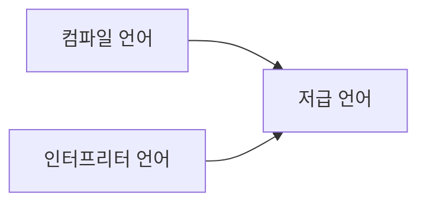

# Chapter3 명령어

## 고급 언어와 저급 언어
### 고급언어
프로그램을 만들 때 사용하느 프로그래밍 언어는 컴퓨터가 이해하는 언어가 아닌 사람이 이해하고 작성하기 쉽게 만들어진 언어입니다. \ 이렇게 '사람을 위한 언어'를 고급 언어라고 합니다.

### 저급언어
반대로 컴퓨터가 직접 이해하고 실행할 수 있는 언어를 저급 언어라고 합니다.\
저급 언어는 명령어로 이루어져 있습니다. 컴퓨터가 이해하고 실행할 수 있는 언어는 오직 저급 언어뿐이다. \
그래서 고급 언어로 작성된 소스코드가 실행되려면 반드시 저급 언어, 즉 명령어로 변환되어야 한다.

저급 언어에는 기계어와 어셈블리어가 있다. \ 
**기계어** : 0과 1의 명령어 비트로 이루어진 언어이다. \
**어셈블리어** : 기계어는 오로지 컴퓨터만을 위해 만들어진 언어이기 때문에 사람이 읽으면 그 의미를 이해하기 어렵다. 따라서 등장한 언어가 어셈블리어이다.

하지만 이 어셈블리어 조차도 사람이 읽기가 쉽지 않다. 그래서 **고급언어**가 필요하다.

## 컴파일 언어와 인터프리터 언어
고급언어로 작성한 소스 코드는 결국 저급 언어로 변환되어 실행되는데 어떻게 변환될까? \
크게 두가지 **컴파일** 방식과 **인터프리트**방식이 있다. \
컴파일 방식으로 작동하는 프로그래밍언어를 컴파일 언어, 인터프리트 방식으로 작동하는 프로그래밍 언어를 인터프리트 언어라고 한다.

### 컴파일 언어
컴파일 언어는 컴파일러에 의해 소스 코드 전체가 저급 언어로 변환되어 실행되는 고급 언어이다. \ 
컴파일이 성공적으로 수행되면 개발자가 작성한 소스 코드는 컴퓨터가 이해할 수 있는 저급 언어로 변환된다.\
이렇게 저급언어로 변환된 코드를 **목적 코드**라고 한다.

### 인터프리터 언어
인터프리터 언어는 인터프리터에 의해 소스 코드가 한 줄씩 실행되는 고급언어이다. \ 
인터프리터 언어는 컴퓨터와 대화하듯 소스 코드를 한 줄씩 실행하기 때문에 소스코드 전체를 저급언어로 변환하는 시간을 기다릴 필요가 없다. \
인터프리터 언어가 컴파일 언어보다 빠르다고 생각할 수도 있지만, 일반적으로 인터프리터 언어는 컴파일 언어보다 느리다. 컴파일을 통해 나온 결과물, 즉 목적코드는 컴퓨터가 이해하고 실행할 수 있는 저급언어인 반면, 인터프리터 언어는 소스 코드 마지막에 이를때까지 한줄 한줄 씩 저급언어로 해석하며 실행해야 하기 때문.

### 목적파일와 실행파일
목적파일와 실행파일는 같은 의미일까? \
목적파일이 실행파일이 되기 위해서는 **링킹**이라는 작업을 거쳐야한다.

## 명령어의 구조
### 연산코드와 오퍼랜드
**명령어**는 연산코드와 오퍼랜드로 구성되어 있다.\
명령어가 수행할 연산인 **연산코드**와 연산에 사용할 데이터, 연산에 사용할 데이터가 저장된 위치를 **오퍼랜드**라고한다. 

### 오퍼랜드
오퍼랜드 필드에는 숫자와 문자 등을 나타내는 데이터 또는 메모리나 레지스터 주소가 올 수 있다.\
다만 오퍼랜드 필드에는 숫자나 문자와 같이 연산에 사용할 데이터를 직접 명시하기보다는, 많은 경우 연산에 사용할 데이터가 저장된 위치, 즉 메모리 주소나 레지스터 이름이 담긴다.\ 그래서 오퍼랜드 필드를 주소필드라고 부르기도 한다.

여기서 오퍼랜드가 명령어에 하나도 없을 수도 있고, 한개, 두개 , 세개 등 여러개가 존재할 수 있다.\ 
하나도 없는 명령어를 0-주소 명령어라고 하고, 하나인 명령어를 1-주소 명령어, 두개인 명령어를 2-주소 명령어라고 한다. 

### 연산코드
#### 연산코드의 유형
1. 데이터 전송
2. 산술/논리 연산
3. 제어 흐름 변경
4. 입출력 제어

##### 데이터 전송 
- MOVE : 데이터를 옮겨라
- STORE : 메모리에 저장하라
- LOAD : 메모리에서 CPU로 데이터를 가져와라
- PUSH : 스택에 데이터를 저장하라
- POP : 스택의 최상단 데이터를 가져와라

##### 산술/논리 연산
- ADD / SUBTRACT / MULTiPLY / DIVIDE : 덧셈, 뺄셈, 곱셈, 나눗셈을 수행하라.
- INCREAMENT / DECREMENT : 오퍼랜드에 1을 더하라. 오퍼랜드에 1을 빼라.
- AND / OR / NOT: AND / OR / NOT 연산을 수행하라.
- COMPARE : 두개의 숫자 또는 TRUE / FALSE 값을 비교해라.

##### 제어 흐름 변경
- JUMP : 특정 주소로 실행 순서를 옮겨라.
- COMDITIONAL JUMP : 조건에 부합할 때 특정 주소로 실행 순서를 옮겨라
- HALT : 프로그램의 실행을 멈춰라.
- CALL : 되졸아올 주소를 저장한 채 특정 주소로 실행 순서를 옮겨라
- RETURN : CALL을 호출할 때 저장했던 주소로 돌아가라

##### 입출력제어
- READ : 특정 입출력 장치로부터 데이터를 읽어라
- WRITE : 특정 입출력 장치로 데이터를 써라
- START IO : 입출력 장치를 시작하라.
- TEST IO : 입출력 장치의 상태를 확인해라.

### 주소 지정 방식
명령어의 길이 때문에 오퍼랜드 필드에 메모리나 레지스터의 주소를 담는다. \
이때 연산 코드에 사용할 데이터가 저장된 위치를 **유효 주소**라고 한다. 

#### 즉시 주소 지정 방식
즉시 주소 지정 방식은 연산에 사용할 데이터를 오퍼랜드 필드에 직접 명시하는 방식 \
표현할 수 있는 데이터의 크기가 작아지는 단접이 있지만, 연산에 사용할 데이터를 메모리나 레지스터로부터 찾는 과정이 없기 때문에 타 주소 지정 방식보다 빠르다.

#### 직접 주소 지정 방식
직접 주소 지정 방식은 오퍼랜드 필드에 유효 주소를 직접적으로 명시하는 방식이다. 

#### 간접 주소 지장 방식
간접 주소 지정 방식은 유효 주소의 주소를 오퍼랜드 필드에 명시한다. \ 
직접 주소 지정방식보다 표현할 수 있는 유효 주소의 범위가 더 넓어졌지만 두번의 메모리 접근이 필요하기 때문에 앞서 설명한 주소 지정 방식들 보다 느리다.

#### 레지스터 주소 지정 방식
레지스터 주소 지정 방식은 직접 주소 지정 방식과 비슷하게 연산에 사용할 데이터를 저장한 레지스터를 오퍼랜드 필드에 직접 명시하는 방법이다. \ 
일반적으로 CPU 외부에 있는 메모리에 접근하는 것 보다. CPU내부의 레지스터에 접근하는 것이 더 빠르다. 

#### 레지스터 간접 주소 지정방식
레지스터 간접 주소 지정 방식은 연산에 사용할 데이터를 메모리에 저장하고, 그 주소를 저장한 레지스터를 오퍼랜드 필드에 명시하는 방법. 

유효 주소를 찾는 과정이 간점 주소 지정 방식과 비슷하지만 메모리에 접근하는 횟수가 한번으로 줄어든다. 