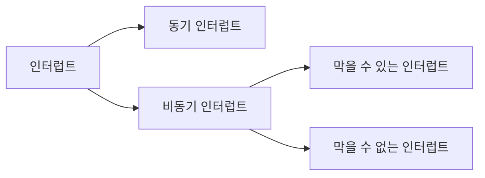

# Chapter4 CPU의 작동원리

## ALU와 제어장치

ALU가 계산을 하기 위해서는 피연산자와 수행한 연산이 필요하다. \
그래서 ALU는 레지스터를 통해 피연산자를 받아들이고, 재어장치로부터 수향할 연산을 알려주는 제어신호를 받아들인다.

연산을 수행한 결과는 특정 숫자나 문자가 될 수도 있고, 메모리 주소가 될 수도 있다. 그리고 이 결괏값은 바로 메모리에 저장되지 않고 일시적으로 레지스터에 저장.\
**CPU가 메모리에 접근하는 속도는 레지스터에 접근하는 속도보다 훨씬 느리다.** ALU가 연산할 때마다 결과를  메모리에 저장한다면 당연하게도 CPU는 메모리에 자주 접근하게 되고, 이는 CPU가 프로그램 실행 속도를 늦출 수 있다. \ 
따라서 ALU의 결과값을 메모리가 아닌 레지스터에 우선 저장한다.

### 플래그
계산 결괏값 외에 ALU는 **플래그**를 내보낸다. \
연산 결과가 음수일 때 ALU는 '방금 계산한 결과는 음수'라는 추가 정보를 내보댄다. 혹은 연산 결과가 연산 결과를 담을 레지스터보다 클 때 ALU는 '결괏값이 너무 크다'(오버플로우)라는 추가 정보를 내보낸다.

이러한 연산결광대한 추가적인 상태 정보를 **플래그**라고 한다.

**대표적인 플래그의 종류**
1. 부호 플래그
2. 제로 플래그
3. 캐리 플래그
4. 오버플로우 플래그
5. 인터럽트 플래그
6. 슈퍼바이저 플래그

이 플래그들은 **플래그 레지스터**라는 레지스터에 저장된다.

### 제어장치
제어장치는 제어 신호를 내보내고, 명령어를 해석하는 부품. 

1. **제어장치는 클럭 신호를 받아들입니다.** \
**클럭**이란 컴퓨터의 모든 부품을 다같이 움직일 수 있게 하는 시간 단위이다. \
클럭의 주기에 맞춰 한 레지스터에서 다른 레지스터로 데이터가 이동되거나, ALU에서 연산이 수행되거나, CPU가 메모리에 저장된 멸령를 읽어들인다. \
하지만 "컴퓨터의 모든 부품이 클럭신호에 맞춰 작동한다" != "컴퓨터의 모든 부품이 한 클럭마다 작동한다." \
컴퓨터 부품들은 클럭이라는 박자에 맞춰 작동할 뿐 한 박자마다 작동하는 건 아니다. 하나의 명령어가 여러 클럭에 걸쳐 실행될 수 있다.

2. **제어장치는 "해석해야 할 명령어"를 받아들인다.** \
CPU가 해석해야 할 명령어는 명령어 레지스터라는 특별한 레지스터에 저장된다. 제어장치는 이 명령어 레지스터로부터 해석할 명령어를 받아들이고 해석한 뒤, 제어 신호를 발생시켜 컴퓨터 부품들에 수행해야 할 내용을 알려준다. 

3. **제어장치는 플래그 레지스터 속 플래그 값을 받아들인다.**

4. **제어장치는 시스템 버스, 그중에서 제어 버스로 전달된 제어 신호를 받아들인다.** \
제어 신호는 CPU뿐만 아니라 입출력장치를 비롯한 CPU 외부 장치도 발생시킬 수 있다. 제어장치는 제어버스를 통해 외부로부터 전달된 제어 신호를 받아들이기도 한다.

제어장치가 내보내는 정보로 **CPU 외부에 전달하는 제어 신호**와 **CPU 내부에 전달하는 제어 신호**가 있다.

**CPU 외부에 전달하는 제어 신호**
- 메모리에 저장된 값을 읽거나 메모리에 새로운 값을 쓰고 싶다면 메모리로 제어신호를 내보낸다. 
- 입출력 장치의 값을 읽거나 새로운 값을 쓰고 싶을때는 입출력 장치로 제어 신호를 내보낸다.

**CPU 내부에 전달하는 제어 신호**
- ALU에 전달하는 제어 신호 \
    ALU에는 수행할 연산을 지시하기 위해
- 레지스터에 전달하는 제어신호 \
    레지스터에는 레지스터 간에 데이터를 이동시키거나 레지스터에 저장된 명령어를 해석하기 위해 제어신호를 내보낸다.

## 레지스터
레지스터만 잘 관찰해도 프로그램의 자세한 실행 과정을 알 수 있다!!

**레지스터의 종류**
- 프로그램 카운터
- 명령어 레지스터
- 메모리 주소 레지스터
- 메모리 버퍼 레지스터
- 플래그 레지스터
- 범용 레지스터
- 스택 포인터
- 베이스 레지스터

### 프로그램 카운터
프로그램 카운터는 메모리에서 가져올 명령어의 주소, 즉 메모리에서 읽어들일 명령어의 주소를 저장한다. 

### 명령어 레지스터
명령어 레지스터는 해석할 명령어, 즉 방금 메모리에서 읽어 들인 명령어를 저장하는 레지스터이다. \
제어장치는 명령어 레지스터 속 명령어를 받아들이고 이를 해석한뒤 제어 신호를 내보낸다.

### 메모리 주소 레지스터
메모리 주소 레지스터는 메모리의 주소를 저장하는 레지스터이다. \
CPU가 읽어 들이고자 하는 주소 값을 주소 버스로 보낼 때 메모리 주소 레지스터를 거치게 된다.

### 범용 레지스터
범용 레지스터는 이름 그대로 다양하고 일반적인 상황에서 자유롭게 사용할 수 있는 레지스터이다. \
범용 레지스터는 데이터와 주소를 모두 저장할 수 있다.

### 플래그 레지스터
연산결과 또는 CPU의 상태에 대한 부가적인 정보를 저장하는 레지스터이다.

### 특정 레지스터를 이용한 주소지정 방식(1) - 스택 주소 지정 방식
프로그램 카운터, 스택 포인터, 베이스 레지스터는 주소 지정에 사용될 수 있는 특별한 레지스터이다. \
스택 포인터는 스택 주소 방식이라는 주소 지정 방식에 사용되고, 프로그램 카운터와 베이스 레지스터는 변위 주소 지정 방식이라는 주소 지정 방식에 사용된다.

#### 스택 주소 지정 방식
스택과 스택 포인터를 이용한 주소 지정 방식

스택은 우리가 아는 그 자료구조, 컨테이너, STL 스택과 같이 동작하는 저장 공간이고, 스택 포인터는 스택의 꼭대기를 가리키는 레지스터이다. \
즉 스택 포인터는 마지막으로 저장한 값의 위치를 저장하는 레지스터이다. \
즉, 스택 포인터는 스택의 어디까지 데이터가 채워져 있는지에 대한 표시라고 보면 된다.

이러한 스택은 어디에 있을까 스택은 메모리 안에 있다. 정확히는 메모리안에 스택처럼 사용할 영역이 정해져 있다. \
이를 **스택 영역**이라고 한다. 해당 영역은 다른 주소 공간과는 다르게 스택처럼 사용하기로 암묵적으로 약속된 영역이다.

### 특정 레지스터를 이용한 주소 지정방식(2) - 변위 주소 지정 방식

#### 변위주소 지정 방식
오퍼랜드의 필드 값(변위)과 특정 레지스터의 값을 더하여 유효 주소를 얻어내는 주소지정 방식이다.

변위 주소 지정 방식을 사용하는 명령어는 연산코드 필드, 어떤 레지스터의 값과 더할지를 나타내는 레지스터 필드, 주소를 담고 있는 오퍼랜드 필드가 있다.\
이때 변위 주소 지정 방식은 오퍼랜드 필드의 주소와 어떤 레지스터를 더하는지에 따라 **상대 주소 지정방식**, **베이스 레지스터 주소 지정 방식**등으로 나뉜다. 

#### 상대 주소 지정 방식
오퍼랜드와 프로그램 카운터의 값을 더하여 유효주소를 얻는 방식이다. \
프로그램 카운터에는 읽어 들일 명령어의 주소가 저장되어 있는데, 오퍼랜드에 -3 과 같은 값이 있다면 CPU는 읽어 들이기로 한 명령어로부터 '세 번째 이전'번지로 접근한다. 

상대 주소 지정 방식은 프로그래밍 언어의 if문과 유사하게 모든 코드를 실행하는 것이 아닌, 분기하여 특정 주소의 코드를 실행할 때 사용 된다.

#### 베이스 레지스터 주소 지정 방식
오퍼랜드와 베이스 레지스터의 값을 더하여 유효 주소를 얻는 방식이다.

베이스레지스터는 '기준 주소', 오퍼랜드는 '기준 주소로부터 떨어진 거리'로서의 역할을 한다. \
즉 베이스 레지스터 주소 지정 방식은 베이스 레지스터 속 기준 주소로부터 얼마나 떨어져 있는 주소에 접근할 것인지를 연산하여 유효 주소를 얻어내는 방식이다.

## 명령어 사이클과 인터럽트
CPU가 하나의 명령어를 처리하는 과정에는 어떤 정해진 흐름이 있고, CPU는 그 흐름을 밤복하며 명령어들을 처리해 나간다. \
이렇게 하나의 명령어를 처리하는 정형화된 흐름을 **명령어 사이클**이라 한다.

그리고 간혹 이러한 흐름이 끊어지는 상황이 발생하는데 이를 **인터럽트**라고 한다.

### 명령어 사이클 
프로그램은 수많은 명령로 이루어져 있고, CPU는 이 명령어들을 하나씩 실행한다. \
이때 프로그램 속 각각의 명령어들은 일정한 주기가 반복되며 실행되는데, 이 주기를 명령어 사이클이라고 한다.

**명령어 사이클의 순서**
1. 인출 사이클 - 메모리에 있는 명령어를 CPU로 가지고 오는 단계
2. 실행 사이클 - 제어장치가 명령어 레지스터에 담긴 값을 해석하고, 제어 신호를 발생시키는 단계
3. 간접 사이클 - 명령어를 인출하여 CPU로 가져오더라도 곧바로 실행할 수 없는 경우가 있다. 간접 주소 지정 방식의 경우 오퍼랜드 필드에 유효 주소의 주소를 명시하는데 이 경우 명령어를 인출하여 CPU로 가져왔다 하더라도 바로 실행 사이클에 들어갈 수 없다. 명령어를 실행하기 위해서 메모리 접근을 한번 더 해야하기 때문. 이 단계를 간접 사이클 이라 한다.

### 인터럽트

CPU의 작업을 방해하는 신호를 인터럽트라고 한다. \
인터럽트의 종류에는 **동기 인터럽트**, **비동기 인터럽트**라고 한다.

#### 동기 인터럽트
동기 인터럽트는 CPU에 의해 발생하는 인터럽트이다. CPU가 명령어들을 수행하다가 예상치 못한 상황에 마주쳤을 때, 발생하는 인터럽트가 동기 인터럽트이다. 이런 점에서 동기 인터럽트는 **예외**라고 부른다. 

#### 비동기 인터럽트 - 하드웨어 인터럽트
주로 입출력 장치에 의해 발생하는 인터럽트이다.
- CPU가 프린터와 같은 입출력 장치에 입출력 작업을 부탁하면 작업을 끝낸 입출력 장치가 CPU에 완료 인터럽트를 보낸다.
- 키보드, 마우스와 같은 입출력장치가 어떠한 입력을 받아들였을 때 이를 처리하기 위해 CPU에 입력 인터럽트를 보낸다.

**명령어를 효율적으로 처리하는 것과 하드웨어 인터럽트가 무슨 상관이 있을까?**

예를 들어 CPU가 프린터에 출력을 명령했다고 가정한다면, 입출력 장치는 CPU보다 속도가 현저히 느리기 때문에 CPU는 입출력 작업의 결과를 바로 받아볼 수 없다. 이때 인터럽트를 사용할 수 없다면, CPU는 프린터가 언제 프린트를 끝낼지 모르기 때문에 주기적으로 프린터의 완료 여부를 확인해야한다. 이로 인해 CPU는 다른 생산적인 일을 할 수 없으니 CPU 사이클 낭비이다.

하드웨어 인터럽트를 이용하면 CPU는 주기적으로 프린트 완료 여부를 확인할 필요가 없다. 프린트의 완료 인터럽트를 받을 때 까지 다른 작업을 처리 할 수 있다.

#### 하드웨어 인터럽트의 처리 순서
1. 입출력 정치는 CPU에 인터럽트 요청 신호를 보낸다.
2. CPU는 실행 사이클이 끝나고 명령어를 인출하기 전 항상 인터럽트 여부를 확인한다.
3. CPU는 인터럽트 요청을 확인하고, 인터럽트 플래그를 통해 현재 인터럽트를 받아들일 수 있는지 여부를 확인
4. 인터럽트를 받아들일 수 있다면 CPU는 지금까지의 작업을 백업.
5. CPU는 인터럽트 벡터를 참조아여 인터럽트 서비스 루틴을 실행한다.
6. 인터럽트 서비스 루틴 실행이 끝나면 4. 에서 백업해 둔 작업을 복구하여 실행을 재개한다.

인터럽트는 cpu의 정상적인 실행 흐름을 끊는 것이기에 다른 누군가가 인터럽트하기 전에는 Cpu에 물어봐야한다. 이를 **인터럽트 요청 신호**라고 한다.

이때, cpu가 인터럽트 요청을 수용하기 위해서는 플래그의 레지스터의 **인터럽트 플래그**가 활성화되어 있어야한다. 인터럽트 플래그는 말 그대로 하드웨어 인터럽트를 받아들일지, 무시할지를 결정하는 플래그로 CPU가 중요한 작업을 처리해야 하거나 어떤 방해도 받지 않아야 할 때 인터럽트 플래그는 불가능으로 설정된다. 

하지만 모든 하드웨어 인터럽트를 인터럽트 플래그로 막을 수 있는 것은 아니다. 인터럽트 플래그가 불가능으로 설정되어 있을지라도 무시할 수 없는 인터럽트 요청도 있다. 정전이다 하드웨어 고장으로 인한 인터럽트가 이에 해당.

CPU가 인터럽트 요청을 받아들이기로 했다면 CPU는 인터럽트 서비스 루틴이라는 프로그램을 실행한다. **인터럽트 서비스 루틴**은 인터럽트를 처리하기 위한 프로그램이다. **인터럽트 핸들러**라고도 부른다. 인터럽트 서비스 루틴은 어떤 인터럽트가 발생했을 때 해당 인터럽트를 어떻게 처리하고 작동해야 할지에 대한 정보로 이루어진 프로그램이다.
요컨데 **"CPU가 인터럽트를 처리한다"** 는 말은 인터럽트 서비슷 투린을 실행하고, 본래 수행하던 작업으로 다시 되돌아 온다라는 말과 같다.

인터럽트를 처리하는 방법은 입출력장치마다 다르므로 각기 다른 인터럽트 서비스 루틴을 가지고 있다 즉, 메모리에는 위 그림처럼 여러 개의 인터럽트 서비스 루틴이 저장되어 있다. 

**그렇다면 CPU는 어떻게 각기 다른 인터럽트 서비스 루틴을 구분할까??**  \
그래서 사용하는 것이 **인터럽트 벡터** \
인터럽트 벡터는 인터럽트 서비스 루틴을 식별하기 위한 정보이다. 인터럽트 벡터를 알면 인터럽트 서비스 루틴의 시작 주소를 알 수 있기 때문에 CPU는 인터럽트 벡터를 통해 특정 인터럽트 서비스 루틴을 처음부터 실행할 수 있다.

**인터럽트가 발생하기 전까지 레지스터에 저장되어 있었던 값들은 어떻게 할까** \
인터럽트 요청을 받기 전까지 CPU가 수행하고 있었던 일은 인터럽트 서비스 루틴이 끝나면 되돌아와서 마저 수행을 해야하기 때문에 지금까지의 작업 내역들은 어딘가에 백업을 해둬야한다. 그렇기에 CPU는 인터럽트 서비스 루틴을 실행하기 전에 프로그램 카운터 값 등 현재 프로그램을 재개하기 위해 필요한 모든 내용을 스택에 백업한다. 그러고 나서 인터럽트 서비스 루틴의 시작 주소가 위치한 곳으로 프로그램 카운터 값을 갱신하고 인터럽트 서비스 루틴을 실행한다. 

