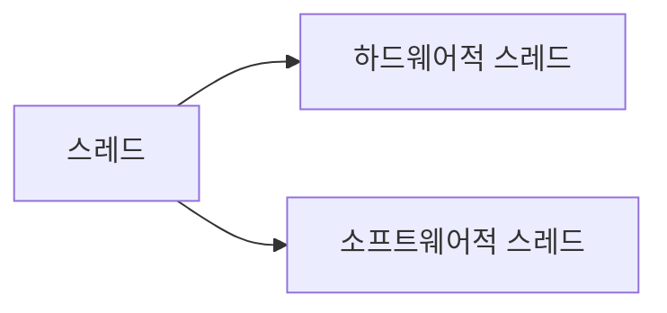

# CPU 성능 향상 기법

## 빠른 CPU를 위한 설계 기법
클럭, 멀티코어, 멀티스레드가 무엇인지 알아볼까

## 클럭
1. 컴퓨터 부품들은 '클럭 신호'에 맞춰 일사분란하게 움직인다.
2. CPU는 '명령어 사이클'이라는 정해진 흐름에 맞춰 명령어들을 실행한다.

이에 따라 클럭 신호가 빠르게 반복되면 CPU를 비롯한 컴퓨터 부품들은 그만큼 빠른 박자에 맞춰 움직인다. \
즉, 클럭 속도가 높아지면 CPU는 명령어 사이클을 더 빠르게 반복할 것이고, 다른 부품들도 그에 발 맞춰 더빠르게 작동할 것이다.

### 클럭 속도
Hz 헤르츠 단위로 측정한다. 이는 1초에 클럭이 몇 번 반복되는 지를 나타낸다. 

### 오버클럭킹
CPU는 계속 일정한 클럭 속도를 유지하기보다는 고성능을 요하는 순간에는 순간적으로 클럭 속도를 높이고, 그렇지 않을 때는 유연하게 클럭 속도를 낮추기도 한다. 최대 클럭 속도를 강제로 더 끌어올릴 수도 있는데, 이를 오버클럭킹이라 한다.

그럼 클럭 속도를 엄청 올리면 좋은 걸까? 그러면 발열이 너무 심해진다. 무리무리

## 코어와 멀티코어
클럭 속도를 높이는 방법 외에 CPU의 성능을 높이는 방법에는 어떤 것들이 있을까? \
대표적으로 CPU의 코어와 스레드 수를 늘리는 방법이 있다.

지금까지 CPU의 정의로 알고 있었던 "명령어를 실행하는 부품"은 오늘날 코어라는 용어로 사용된다. \
다시 말해 오늘날의 CPU는 단순히 '명령어를 실행하는 부품'에서 '명령어를 실행하는 부품을 여러개 포함하는 부품'으로 명칭의 범위가 확장되었다.

코어를 여러 개 포함하고 있는 CPU를 멀티코어 CPU, 멀티코어 프로세서라고 부른다. 이는 CPU 내에 명령어를 처리하는 일꾼이 여러 명 있는 것과 같다. 

## 스레드와 멀티 스레드
스레드의 사전적 의미는 "실행 흐름의 단위"이지만 이대로 받아드려서는 안된다.


### 하드웨어적 스레드
스레드를 하드웨어적으로 정의하면 '하나의 코어가 동시에 처리하는 명령어 단위'를 의미한다.
1코어 1스레드 CPU의 경우 명령어를 실행하는 부품이 하나 있고, 한번에 하나씩 명령어를 실행하는 CPU이다.

반면, 여러 스레드를 지원하는 CPU는 하나의 코어로도 여러 개의 명령어를 동시에 실행할 수 있다.\
예를 들어 2코어 4스레드 CPU는 아래 그림처럼 명령어를 실행하는 부품을 두개  포함하고, 한번에 네 개의 명령어를 처리할 수 있는 CPU를 의미한다.

이처럼 하나의 코어로 여러 명령어를 동시에 처리하는 CPU를 멀티스레드 프로세서 또는 멀티스레드 CPU라고 한다.

### 소프트웨어적 스레드
소프트웨어적으로 정의된 스레드는 '하나의 프로그램에서 독립적으로 실행되는 단위' 이다.\
한마디로 하나의 프로그램에서 여러개로 분리된 실행단위를 뜻한다. 

### 멀티스레드 프로세스
멀티스레드 프로세서를 실제로 설계하는 일은 매우 복잡하지만, 가장 큰 핵심은 레지스터이다. 하나의 코어로 여러 명령어를 동시에 처리하도록 마느려면 pc, sp, 데이터 버퍼 레지스터, 데이터 주소 레지스터와 같이 하나의 명령어를 처리하기 위해 꼭 필요한 레지스터를 여러개 가지고 있으면 된다. 

메모리 속 프로그램 입장에서 봤을 때 하드웨어 스레드는 마치 '한번에 하나의 명령어를 처리하는 CPU'나 다름이 없다. 2코어 4스레드 CPU는 한번에 네 개의 명령어를 처리할 수 있는데, 프로그램 입장에서 봤을 때는 한 번에 하나의 명령어를 처리하는 CPU가 네 개 있는 것처럼 보인다. 그래서 하드웨어 스레드를 논리 프로세서라고 부르기도 한다.

## 명령어 병렬 처리 기법
CPU를 놀지 않게 만들어 보자

### 명령어 파이프라인
명령어 처리 과정을 클럭 단위로 나누어 보면 
1. 명령어 인출 
2. 명령어 해석
3. 명령어 실행
4. 결과 저장

여기서 알 수 있는 부분은 각 과정에서의 사용되는 레지스터가 다르기 때문에 CPU는 각 단계를 동시에 실행할 수 있다. 

```
그림 추가(아주 중요)
```

이게 바로 명령어 파이프라이닝~!

파이프라이닝이 높은 성능을 가져오기는 하지만, 특정 상황에서는 성능 향상에 실패하는 경우도 있다. 이걸 **파이프라인 위험**이라고 부른다. \
파이프라인 위험에는 크게 **데이터 위험, 제어 위험, 구조적 위험**이 있다.

#### 데이터 위험
데이터 위험은 명령어 간 **데이터 의존성**에 의해 발생한다. \
명령어를 무조건 동시에 실행할 수 있는 것은 아니다. 어떤 명령어는 이전 명령어의 결과값이 필요할 때가 있는 법.

```
명령어 1 : R1 <- R2 + R3
명령어 2 : R4 <- R1 + R5
```

#### 제어 위험
제어 위험은 주로 분기 등으로 인한 'pc의 갑작스러운 변화'에 의해 발생한다. \
기본적으로 프로그램 카운터는 현재 실행중인 명령어의 다음 주소로 갱신된다. 하지만 프로그램 실행 프름이 바뀌어 명령어가 실행되면서 프로그램 카운터 값에 갑작스러운 변화가 생긴하면 명령어 파이프 라인에 미리 가지고 와서 처리 중이었던 명령어들은 아무 쓸모가 없어진다. 

이를 위해 사용하는 기술 중 하나가 **분기 예측** 이다. 분기예측은 프로그램이 어디로 분기할지 미리 에측한 후 그 주소를 인출하는 기술이다.

#### 구조적 위험
구조적 위험은 명령어들을 겹쳐 실행하는 과정에서 서로 다른 명령어가 동시에 ALU, 레지스터 등과 같은 CPU 부품을 사용하려고 할 때 발생한다. 

### 슈퍼 스칼라
파이프라이닝은 단일 파이프라인으로도 구현이 가능하지만, 여러 개의 명령어 파이프라인도 가능. 이걸 **슈퍼 스칼라**라고 한다.

### 비순차적 명령어 처리 OoOE
**합법적인 새치기** 

```
1. M(100) <- 1
2. M(100) <- 2
3. M(100) <- M(100) + M(101)
4. M(100) <- 1
5. M(100) <- 2
6. M(100) <- 3
```
3번 명령어는 1번과 2번 명령어가 끝날때 까지 기다려야 한다. 
그래서 전혀 상관없는 4, 5, 6 번 명령어 문저 처리하는 것이 효율적이다.
```
1. M(100) <- 1
2. M(100) <- 2
3. M(100) <- 1
4. M(100) <- 2
5. M(100) <- 3
6. M(100) <- M(100) + M(101)
```
이렇게 순서를 바꿔 실행해도 무방한 명령어를 먼저 실행하여 명령어 파이프 라인이 멈추는 것을 방지하는 것이 **비순차적 명령어 처리 기법** 이라고 한다.

## CISC와 RISC
세상 모든 CPU가 이해하고 실행하는 명령어들이 다 똑같을까? 다르죠 당연히 \
각각 CPU가 이해사 이해할 수 있는 명령어들의 모음을 명령어 집합 또는 명령어 집합 구조 ISA라고 한다. 

인텔 CPU에서 만든 실행파일을 ARM에서 실행하려고 할때 특별한 처리 없이는 안된다.

ISA가 같은 CPU끼리는 서로의 명령어를 이해할 수 있지만 다르면 안된다!
여러 ISA중에 명령어 병렬 처리 기법들을 적용하기 용이한 ISA가 있고 뭐뭐 각각 ISA마다 트레이드 오프가 존재한다.

지금 현대에 가장 많이 사용되는 ISA의 양대 산맥, 쌍두마차, 용호상박, 자강두천인 CISC, RISC에 대해 알아보자.

### CISC
CISC는 complex instruction Set Computer의 약자로 '복잡한 명령어 집합을 활용하는 컴퓨터'를 의미한다.  \
CISC는 다양하고 강력한 기능의 명령어 집합을 활용하기 때문에 명령어의 형태와 크기가 다영한 **가번 길이 명령어**를 활용한다. 매모리에 접근하는 주소 지정 방식도 다양해서 아주 특별한 상황에서만 사용되는 독특한 주소 지정방식들이 있다.

다양하고 강력한 명령어를 활용한다는 말은 상대적으로 적은 수의 명령어로도 프로그램을 실행할 수 있다는 것을 의미.

이런 장점 때문에 CISC는 메모리르 최대한 아끼며 개발해야 했던 시절에 인기가 높았다. \
하지만 치명적인 단점이 존재했는데, 활용하는 명령어가 워낙 복잡하고 다양한 기능을 제공하는 탓에 명령어의 크기와 실행되기까지의 시간이 일정하지 않았고 복잡한 명령어 때문에 명령어 하나를 실행하는데 여러 클럭 주기를 필요로 한다.

이것은 명령어 파이프라인을 구현하는데에 큰 걸림돌이 된다. 그리고 대다수의 복잡한 명령어는 사용 빈도가 낮았다. 20%정도의 명령어가 사용된 전체 명령어의 80%가량을 차지한다는 것.

### RISC
CISC 방식으로 알게된 내용
1. 빠른 처리를 위해 명령어 파이프라인을 십분 활용해야한다. 원활한 파이프라이닝을 위해' 명령어 길이와 수행시간이 짧고 규격화'되어 있어야 한다.
2. 어차피 자주 쓰이는 명령어만 줄곧 사용된다. 복잡한 기능을 지원하는 명령어를 추가하기보다는 '자주사용되는 기본적인 명령어를 작고 빠르게 만드는 것'이 중요하다.

이 원칙 하에 등장한 것이 RISC, reduced instruction set computer이다
CISC에 비해 명령어의 종류가 적고, CISC와 달리 짧고 규격화되 명령어, 되도록 1클럭 내외로 실행되는 명령어를 지향한다.

즉, RISC는 고정 길이 명령어를 활용한다.
명령어가 규격화되어 있고, 하나의 명령어가 1클럭 내외로 실행되기 때문에 RISC 명령어 집합은 명령어 파이프라이닝에 최적화되어 있다.

그리고 RISC는 메모리에 직접 전근하는 명령어를 LOAD, STORE 두개로 제한할 만큼 메모리 접근을 단순화하고 최소화를 추구한다. 그렇기 때문에 CISC보다 주소 지정 방식의 종류가 적은 경우가 많다.

RISC는 메모리 접근을 단순화, 최소화하는 대신 레지스터를 적극적으로 활용한다. 그렇기에 CISC보다 레지스터를 이용하는 연산이 많고, 일반적인 경우보다 범용 레지스터 개수도 더 많다.


