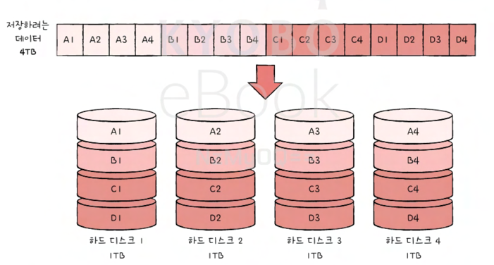
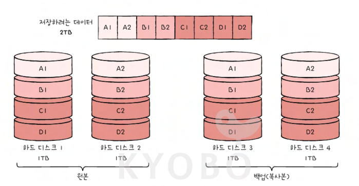
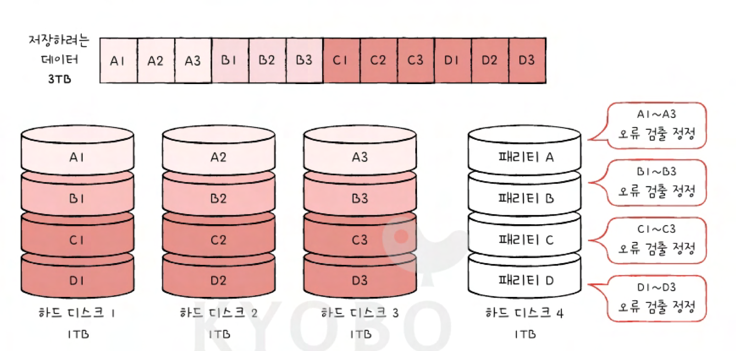
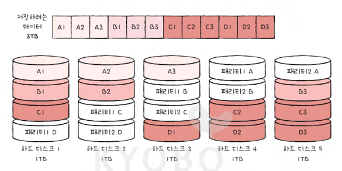

# 보조기억 장치

## 다양한 보조기억장치
하드 디스크와 플래시 메모리

### 하드 디스크
하드 디스크는 자기적인 방식으로 데이터를 저장하는 보조기억장치이다. 하 디크에서 실질적으로 데이터가 저장되는 곳은 내부의 동그란 원판이다. 이를 **플래터**라고 한다. \
하드 디스크는 자기적인 방식으로 데이터를 저장하는데, 플래터는 자기물질로 덮여 잇어 수많은 N극과 S극을 저장한다. N극과 S극과 0과 1의 역할을 수행한다. \
그 플래터를 최전 시키는 구성 요소를 **스핀들**이라고 한다. 스핀들이 플래터를 돌리는 속도는 RPM이라는 단위로 표현된다. 

플래터를 대상으로 데이터를 읽고 쓰는 구성 요소는 **헤드**라고 하며 플래터 위에서 미세하게 떠 있는 채로 데이터를 읽고 쓰는, 마치 바늘같이 생긴 부품이다. 그리고 헤드는 원하는 위치로 헤드를 이동시키는 **디스크 암**에 부착되어 있다.

CD나 LP에 비해 하드 디스크는 훨씬 더 많은 양의 데이터를 저장해야 하므로 일반적으로 여러겹의 플래터로 이루어져 있고 플래터 양면을 모두 사용할 수 있다. 양면 플래터를 사용하면 위아래로 플래터당 두 개의 헤드가 사용된다. 이때 일반적으로 모든 헤드는 디스크암에 부착되어 다같이 이동한다.

#### 그럼 어떻게 데이터가 저장 될까??!?
플래터는 **트랙**과 **섹터**라는 단위로 데이터를 저장한다. 플래터 위의 하나의 원을 트랙이라 하고 이 트랙을 피자조각으로 나누었을 때, 한조각을 섹터라고 한다. \
섹터는 하드 디스크의 가장 작은 전송 단위로 일반적으로 512바이트 정도의 크기를 가지고 있다. 사실 이건 하바하(하드 바이 하드)

여러겹의 플래터 상에서 같은 트랙이 위치한 곳을 모아 연결한 논리적 단위를 **실린더**라고 한다. 쉽게 말해 한 플래터를 돈심원으로 나눈 공간은 트랙, 같은 트랙 끼리 연결한 원통 모양의 공간은 실린더이다. \
연속된 정보는 보통 한 실린더에 기록된다. 이 이유는 디스크 암을 움직이지 않고도 바로 데이터에 접근할 수 있기 때문이다.

이제 저장된 데이터에 접근하는 과정을 알아보자.\
하드 디스크가 저장된 데이터에 접근하는 시간은 크게 **탐색 시간**, **회전 지연**, **전송 시간** 으로 나뉜다. 
- 탐색 시간 : 접근하려는 데이터가 저장된 트랙까지 헤드를 이동시키는 시간을 의미한다.
- 회전 지연 : 헤드가 있는 곳으로 플래터를 회전시키는 시간을 의미
- 전송 시간 : 하드 디스크와 컴퓨터 간에 데이터를 전송하는 시간

| 어디를 읽을까?   | 시간  |
|---------|---------|
| L1 캐시 참조 시간 | 0.5ns   |
| L2 캐시 참조 시간 | 5ns   |
| 메모리 참조 시간 | 7ns   |
| 메모리에서 1MB를 순차적으로 읽는 시간 | 250,000ns   |
| 하드 디스크 탐색 시간 | 10,000,000ns |
| 하드 디스크에서 1MB를 순차적으로 읽는 시간 | 30,000,000ns |
| 하나의 패킥이 캘리포니아에서 네덜란드까지 왕복하는 시간 | 150,000,000ns |

하드 디스크 너무 느리다...!

#### 다중 헤드 디스크와 고정 헤드 디스크
단일 헤드 디스크는 헤드가 하나로 탐색 시간이 소요되지만 다중 헤드 디스크는 트랙마다 헤드가 달려 있기 때문에 탐색 시간이 들지 않는다.
이런 점에서 다중 헤드 디스크를 고정 헤드 디스크라고 부른다.

### 플래시 메모리
우리가 흔히 사용하는 USB, SD, SSD가 모두 플래시 메모리 기반의 보조기억장치이다.

플래시 메모리는 전기적으로 데이터를 읽고 쓸 수 있는 반도체 기반의 저장 장치이다. 사실 플래시 메모리는 보조기억 장치 범주에만 속한다기 보다는 다양한 곳에서 널리 사용하는 저장 장치로 보는 것이 옳다. 

플래시 메모리에는 **셀**이라는 단위가 있다. 이 셀이 모이고 모여 MB, GB, TB용량을 갖는 저장 장치가 된다. 이 셀 하나에 몇 비트를 저장할 수 있느냐에 따라 플래시 메모리 종류가 나뉜다. 한 셀에 1비트를 저장할 수 있는 플래시 메모리를 **SLC(single level cell)** 타입, 한 셀에 2비트는 **MLC(multiple level cell)**타입, 한 셀에 3비트 **TLC(triple level cell)** 타입이라고 한다. 큰 차이가 아닌 것 같아도 이는 플래시 메모리의 수명, 속도, 가격에 큰 영향을 끼친다. 4비트인 QCL도 있당.

#### SLC 타입
SLC 타입은 한 셀로 두개의 정보를 표현할 수 있다. 홀로 거주하는 집에 제약 없이 출입이 가능하듯 다른 타입에 비해 비트의 빠른 입출력이 가능하다. 수명도 다른 타입에 비해 길고, 가격이 비쌉니다. 마치 방에 혼자 살면 부담해야할 주거 비용이 커지듯이요. 보통 기업에서 고성능의 빠른 저장 장치가 필요할 경우 SLC를 사용한다.

#### MLC 타입
MLC는 하나의 셀로 네개의 정보를 표현할 수 있다. 속도와 수명은 떨어지지만 한 셀에 두비트 씩 저장할 수 있다는 점에서 대용화하기 유리하다. 시중에서 사용되는 많은 플래시 메모리 저장 장치들이 MLC혹은 TLC로 만들어진다.

#### TLC 타입
한 셀로 여덟 개의 정보를 표현 가능하다. 대용화에 아주 유리하지만, 속도와 수명이 떨어지지만 가격이 저렴합니다.

**이제 셀보다 더 큰 단위를 알아보자.**
- 페이지 : 셀들이 모여 만들어진 단위
- 블록 : 페이지가 모여 만들어진 단위
- 플레인 : 블록이 모여 만들어진 단위
- 다이 : 플레인이 모여 만들어진 단위
플래시 메모리에서 읽기와 쓰기는 페이지 단위로 이루어 진다. 하지만 삭제는 페이지보다 큰 블록 단위로 이루어 지는데 이것이 플래시 메모리의 가장 큰 특징 중 하나이다.

이때 페이지는 세개의 상태를 가질 수 있다. 이는 각각 Free, Valid, Invalid 상태이다.
##### Free 
어떠한 데이터도 저장하고 있지 않아 새로운 데이터를 저장할 수 있는 상태를 의미.
##### Valid 
이미 유효한 데이터를 저장하고 있는 상태
##### Invalid
쓰레기값이라 부르는 유효하지 않은 데이터를 저장하고 있는 상태.

플래시 메모리는 하드 디스크와 달리 덮어쓰기가 불가능하여 Valid상태인 페이지에는 새 데이터를 저장할 수 없다.

##### 가비지 컬렉션 
하나의 페이지를 새로운 데이터로 업데이트 하고 싶다면 새 공간에 새로운 데이터를 저장하고 원래의 데이터는 삭제해야할 것이다. 따라서 플래시 매모리는 가비지 컬랙션을 이용해 이를 지우는데 
1. 유효한 페이지만을 새로운 블록으로 복사
2. 기존의 블록을 삭제
이러한 절차로 메모리의 유효한 데이터만 저장할수 있게끔 동작한다.

## RAID의 정의와 종류

### RAID의 정의
RAID란 Redundant Array of Independent Disks로 데이터의 안전성 혹은 높은 성능을 위해 여러 개의 물리적 보조기억장치를 \
마치 하나의 논리적 보조기억 장치처럼 사용하는 기술을 의미한다.

### RAID의 종류
RAID의 구성 방법을 RAID레벨이라 표현하는데, RAID 레벨에는 대표적으로 RAID0,RAID1, RAID2, RAID3, RAID4, RAID5, RAID6이 있고, \
그로 부터 파생된 RAID10, RAID50 등이 있다.

#### RAID 0
RAID 0 은 여러개의 보조기억장치에 데이터를 단순히 나누어 저장하는 구성 방식이다. 

1TB 하드 디스크 네 개로 RAID 0을 구성할때, 각 하드 디스크는 번갈아 가며 데이터를 저장한다. \
즉, 저장되는 데이터가 하드 디스크 개수만큼 나뉘어 저장되는 것이다. \
이때, 마치 줄무의처럼 분산되어 저장된 데이터를 **스트라입**이라고 하고, 분산하여 저장하는 것을 **스트라이핑**이라고한다.

이처럼 데이터가 분산되어 저장되면, 다시 말해 스트라이핑되면 저장된 데이터를 읽고 쓰는 속도가 빨라진다. 하나의 대용량 장치를 이용했더라면 여러 번에 걸쳐 읽고 썼을 데이터를 동시에 읽고 쓸 수 있기 때문이다.\
하지만 단점이 존재한다. RAID 0으로 구성된 하드디스크 중 하나에 문제가 생긴다면 다른 모든 하드 디스크의 정보를 읽는데 문제가 생길 수 있다. \
그래서 등장한 것이 RAID 1!!

#### RAID 1
RAID 1은 복사본을 만드는 방식이다. 완전한 복사본을 만드는 구성이기에 **미러링**이라고 부른다.\
아래 그림은 네 개의 하드를 RAID 1로 구성한 모습이다. RAID 0처럼 데이터 스트라이핑이 사용되긴 했지만, 오른쪽 두 하드 디스크는 왼쪽의 하드와 동일한 내용을 저장하고 있다. \
이처럼 RAID 1에 어떠한 데이터를 쓸 때는 원본와 복사본 두군데에 쓴다. 그래서 쓰기속도는 RAID 0보다 느릴 수 밖에 없다.

RAID 1은 복구가 간단하다는 장점이 있지만 하드 디스크 개수가 한정되었을 때, 사용 가능한 용량이 적어지는 단점이 있다.

#### RAID 4
RAID 4는 RAID 1처럼 완전한 복사본을 만드는 대신 오류를 검출하고 복구하기 위한 정보를 저장한 장치를 두는 구성 방식이다. \
이때 '오류를 검출하고 복구하기 위한 정보'를 **패리티 비트**라고 한다. RAID 4에서는 패리티를 저장한 장치를 이용해 다른 장치들의 오류를 검출하고, 오류가 있다면 복구한다. \
이로써 RAID 4는 RAID 1보다 적은 하드 디스크로도 데이터를 안전하게 보관할 수 있다.

#### RAID 5
RAID 4에서는 어떤 새로운 데이터가 저장될 때마다 패리티를 저장하는 디스크에도 데이터를 쓰게되므로 패리티를 저장하는 장치에 병목현상이 발생한다는 문제가 있다.
RAID 5는 패리티 디스크를 따로 두지 않고 패리티 정보를 분산하여 저장하여 병목현상을 해소한다. 

#### RAID 6
RAID 6의 구성은 기본적으로 RAID 5와 같으나, 서로 다른 두 개의 패리티를 두는 방식이다. 이는 오류를 검출하고 복구할 수 있는 수단이 생긴 셈이다. \
따라서 RAID 6은 RAID 4나 RAID 5보다 안전한 구성이라 볼 수 있다. \
하지만 새로운 정보를 저장할 때마다  함께 저장할 패리티가 두 개이므로, 쓰기 속도는 RAID 5보다 느리다. 따라서 RAID 6은 데이터 저장 속도를 조금 희생하더라도 \
데이터를  더욱 안전하게 보관하고 싶을 때 사용하는 방식이다.

