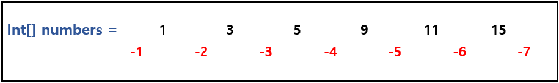

## [네트워크](https://school.programmers.co.kr/learn/courses/30/lessons/388353)
### 문제 풀이 방식
각 컴퓨터를 순회하여 방문하지 않은 노드라면,
정답 수를 하나씩 증가하고 bfs로 순회하여 인접한 컴퓨터를 모두 방문하도록 하였습니다.


## [숫자 게임](https://school.programmers.co.kr/learn/courses/30/lessons/12987)
### 문제 풀이 방식
처음엔 완전 탐색인가 했지만 역시나 시간초과가 나서, 그리디로 해결하였습니다.  
A팀을 이길 수 있는 가장 작은 점수를 찾아서 매칭해주었습니다.

`Collections.binarySearch`를 활용해서 A팀의 점수를 확인하면서 해당 점수보다 큰 B팀의 점수 인덱스를 찾고, 해당 점수는 리스트에서 제거해주었습니다.

- Collections.binarySearch의 반환값
  - key가 존재 O : key의 인덱스
  - key가 존재 X : -(삽입 위치) - 1 (index < 0)
  

중복되는 원소가 있는 경우는 인덱스가 랜덤으로 반환되지만 해당 문제에서는 위치가 중요한 것은 아니기 떄문에 찾은 값은 바로 삭제하는 방식으로 구현하였습니다.

```java
 // 점수보다 더 큰 수의 위치 찾기
int idx = Collections.binarySearch(listB, A[i] + 1);

// 정확한 값이 없는 경우, 더 큰 수의 위치로 설정
if (idx < 0) {
    idx = -idx - 1;
}
// 리스트에서 제거 및 점수 증가
if (idx < listB.size()) {
    listB.remove(idx);
    answer++;   
}
```


## [지게차와 크레인](https://school.programmers.co.kr/learn/courses/30/lessons/388353)
지게차와 크레인에 따라서 removeAll, removeEdge함수로 나누어서 구현을 하였습니다.  
핵심은 removeEdge였는데, bfs로 구현하였습니다.

입력받은 stoarge의 가로세로를 2씩 늘려서, 가장자리가 0으로 채워져있는 배열인 current로 만들어서 사용하였습니다.  
0,0부터 bfs를 진행하면서 가장자리인 경우에는 큐에 넣어주고, 찾는 알파벳인 경우에는 큐에 넣지 않고 current를 갱신해주었습니다.

```java
if (current[ni][nj] == 0) { // 가장자리
  visited[ni][nj] = true;
  Q.offer(new int[]{ni, nj});
} else if (current[ni][nj] == c) { // 찾는 알파벳
  visited[ni][nj] = true;
  current[ni][nj] = 0;
}
```

사실 이 풀이는 지피티가 고쳐준 풀이,,,  
이 풀이가 맞는건 알겠는데! 반례를 정말 못 찾겠어서 기존 제 풀이가 틀렸다는 사실을 납득하지 못했었는데, 질문게시판에 올라온 반례를 보고 납득하였습니다...

여기에 틀린 코드 전체와 반례 결과를 전부 옮기기엔 너무 길 것 같아서 궁금하시다면 [이 링크](https://spiffy-centipede-875.notion.site/1f062570e7c480ae8e7fd779422c05da?pvs=4) 에서 확인하시길 바랍니다~

