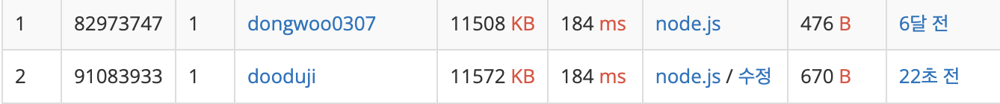

# 문제 1 이 구역의 승자는 누구야?!

## 문제 흐름

그냥 뭐.. map마냥 알파벳에 맞는 획순을 매핑해놓고 더 했다.

그리고 수학적으로 보았을 때, 덧셈은 교환법칙이 성립해서 그냥 앞에서부터 하나씩 더했다.

ㅎㅎ 백준 시간1등했어요


## 코드 설명

```js
for (let i = 0; i < str.length; i++) {
  sum += obj[str[i]];
  if (sum > 10) {
    sum %= 10;
  }
}
```

# 문제 2 지구 온난화

## 문제 흐름

와 생각보다 귀찮았다. 그냥 bfs딸깍하려고했는데? 어 출력 어케하지 고민했다.

그냥 원시적으로.. 출력해야하는 행,열을 저장해서 출력했다 ㅎㅎ

## 코드 설명

```js
for (let i = 0; i < R; i++) {
  for (let j = 0; j < C; j++) {
    if (tempArr[i][j] === "X") {
      startX = Math.min(startX, i);
      endX = Math.max(endX, i);
      startY = Math.min(startY, j);
      endY = Math.max(endY, j);
    }
  }
}
for (let i = startX; i <= endX; i++) {
  for (let j = startY; j <= endY; j++) {
    ans += tempArr[i][j];
  }
  ans += "\n";
}
```

# 문제 3 톱니바퀴

## 문제 흐름

오랜만에 본 톱니바퀴.

아직도 생각난다. 톱니바퀴 문제의 핵심은 회전방향을 저장해야한다는 것!

회전을 시키고 회전방향을 확인하면 N S가 바뀔수도 있기때문에~

그래서 회전방향을 저장하고 돌렸다 ㅎㅎ 계산은 쉽고만

## 코드 설명

```js
let directions = [0, 0, 0, 0];
directions[num] = dir;
for (let i = num - 1; i >= 0; i--) {
  if (arr[i][2] !== arr[i + 1][6]) {
    directions[i] = -directions[i + 1];
  } else {
    break;
  }
}
```

# 문제 4 파일 탐색기

## 문제 흐름

진짜 겁나 귀찮았다. 금방풀 줄 알았는데.. 문제 낸놈 누굴까...

어떻게할지 감이 안와서 찾아봤는데 자바스크립트는 업구만 ㅠ

그래서 그냥 c++코드보고 자스로 수정했습니다.

문제에서 요구하는 정렬 순서대로 정말 정렬하면됐다..

그전에 파싱하는것마냥 문자열들을 tokenize하고 token으로 비교를 해주었다. 어렵다 참..

## 코드 설명

```js
다 중요한거같은데..
```
