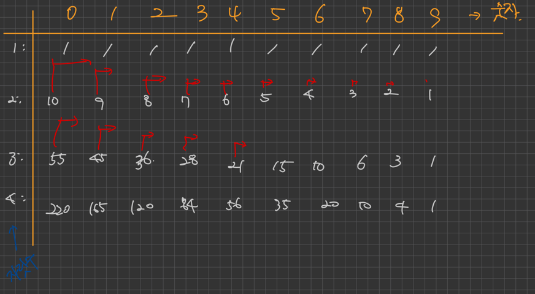

# 오르막 수 

오르막수는 특정 자릿수의 수가 오름차순을 이루는 수를 뜻하는데, 각 자리 수의 경우의 수를 모두 적게 되면 
사진과 같은 패턴이 나오게 된다.

가로축은 시작하는 수를 의미하는데 0으로 시작 할수록 오르막수의 경우의 수가 더 많겟죠?? \
그래서 일단 한자리 수인 1은 1로 가득 채우고 시작 해봅시다.\
두자릿 수의 경우 만약 0으로 시작하는 수일 경우 : 01, 02, 03, 04, 05, 06, 07, 08, 09 10개가 된다.
이 수는 한 자릿수의 0 ~ 9 까지지의 수의 합과 똑같다.-> 0 X (X >= 0)
1로 시작하는 수일 경우 : 11, 12, 13, 14, 15, 16, 17, 18, 19 9개 -> 0 X (X >= 1)

결국 중요한 것은 시작하는 한자리를 제외한 나머지 자릿수의 경우의 수는 이전 배열에서 찾아야 한다는 점이다.
```java
for (int i = 1; i < 1001; i++) {
    for (int j = 0; j < 10; j++) {
        int sum = 0;
        for (int k = j; k < 10; k++)
            sum += dp[i - 1][k];
        dp[i][j] = sum % 10007;
    }
}
```
